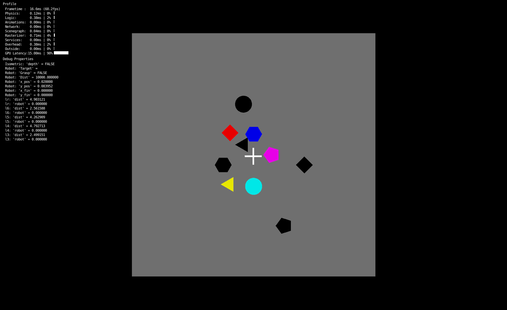
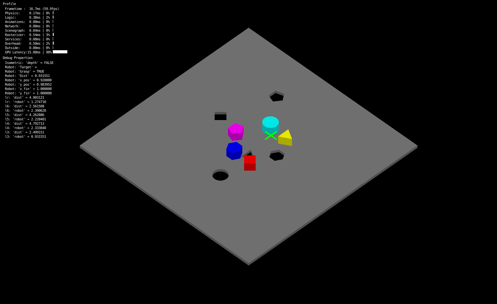
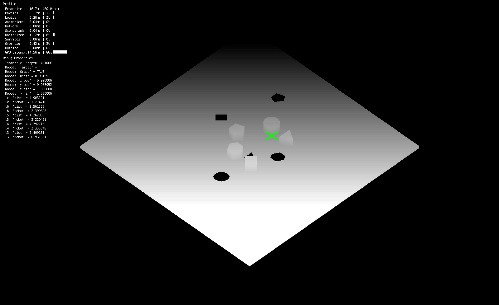

# Shape Sorter

This is a simple physic simulator for the shape sorting problem. Object are moved by the robot, represented by the green/white cross. The simulator responds on a UDP socket (local on port 9999), with a very simple `json` protocol.

``` json
{
  'com': 'command',
  'val': 'value_for_the_command'
}
```

The command now implemented are:

| Command        | Value      | Description                                                                   |
|----------------|------------|-------------------------------------------------------------------------------|
| `'position'`   | `[x, y]`   | Set a new position to reach for the robotic hand. Must be a list of two float |
| `'screenshot'` | `filename` | Makes a screenshot, value represent filename for the sreenshot                |
| `grab`         | `0|1`      | Tries to grab an object                                                       |

There are some keyboard commands:

 * :arrow_up:, :arrow_down:: moves `y` axis
 * :arrow_left:, :arrow_right:: moves `x` axis
 * `space`: grab/ungrab
 * `c`: change camera (between 2D top and isometric)
 * `d`: toggle depth view (must be in isometric view)

New api will be added in the next few days. Here some screenshots generated using the apis:




